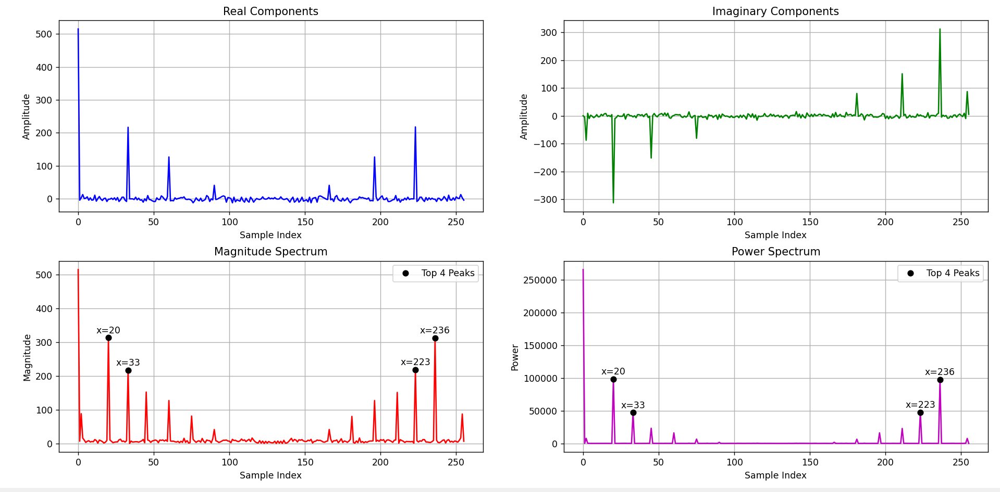

# 256-Point FFT on FPGA (ZedBoard) with HDMI Output

## Overview

This project implements a **256-point Decimation-in-Time (DIT) FFT** on the ZedBoard using custom Verilog and displays the real-time spectrum on an HDMI monitor.
The design integrates PL-based signal processing with PS-controlled video output, effectively turning the setup into a **hardware spectrum analyzer**.

The FFT core is written from scratch using state machines, verified in simulation, and then deployed on the FPGA. The computed samples are transferred from PL to PS through dual-port RAM and rendered via an HDMI pipeline built using Xilinx video IPs.

---

## Key Features

* Custom **256-point DIT FFT** written in Verilog
* State-machine based architecture for deterministic control
* Testbench verification before hardware deployment
* Real-time HDMI display of FFT spectrum
* PL → PS data transfer using **Dual-Port BRAM**
* Live signal testing using **Analog Discovery** and XADC inputs
* Works as a **real-time hardware spectrum analyzer**

---

## System Architecture

### Processing Flow

1. Input samples provided through XADC headers (real-time signals).
2. Custom Verilog FFT core processes 256 samples in PL.
3. FFT outputs written into dual-port BRAM (PL side).
4. Zynq PS reads FFT results from BRAM.
5. PS drives HDMI video pipeline and renders spectrum.
6. Peaks observed in real time for sine and multi-tone inputs.

---

## Block Design

The system integrates Zynq PS, HDMI pipeline, BRAM interface, and custom FFT module.

* Zynq Processing System (PS)
* AXI SmartConnect & AXI BRAM Controller
* Dual-port Block RAM
* Custom FFT IP
* AXI VDMA
* Video Processing Subsystem
* Video Timing Controller
* AXI4-Stream to Video Out
* HDMI output interface

*(Block design diagram below)*


The exported design shows the full integration of PS, AXI interconnects, BRAM, HDMI video chain, and the custom FFT core driving the system .

---

## HDMI Video Pipeline

The HDMI output is implemented using Xilinx IPs:

* Video Processing Subsystem
* Video Timing Controller
* AXI Stream to Video Out
* AXI VDMA
* Zynq PS control interface

The PS configures and controls the HDMI monitor while rendering FFT magnitude data in real time.

---

## FFT Implementation Details

### Algorithm

* 256-point Decimation-in-Time FFT
* Butterfly computation stages implemented using FSM
* Fixed-point arithmetic
* Sequential state-machine driven computation

### Verification

* Testbench simulation performed
* Output captured from BRAM and plotted in Python

---

## Testbench Output (Python Visualization)

FFT magnitude and spectrum obtained from simulation before hardware deployment.



---

## Hardware Setup

Real-time signals were injected using Analog Discovery and XADC headers.

* Pure sine wave inputs
* Multi-tone combinations
* Observed peaks on HDMI display


This demonstrates the project functioning as a real-time spectrum analyzer.

---

## Data Transfer Architecture

* FFT computed in PL
* Results written to BRAM (PL side)
* PS reads BRAM data
* HDMI rendering handled by PS

This separation allows efficient computation in hardware while maintaining flexible visualization control.

---

## Repository Structure

```
.
├── verilog/
│   ├── fft_core.v
│   ├── butterfly.v
│   └── state_machine_modules/
│
├── vivado_project/
│   └── block_design/
│
├── sdk_ps_code/
│   └── hdmi_control/
│
├── testbench/
│   └── fft_tb.v
│
├── docs/
│   ├── block_design.pdf
│   ├── python_fft_plot.png
│   └── hardware_setup_hdmi_output.jpg
│
└── README.md
```

---

## Tools & Technologies

* Verilog HDL
* Vivado (Block Design + IP Integration)
* Zynq-7000 (ZedBoard)
* HDMI Video IP stack
* Analog Discovery
* Python (for FFT output plotting)

---

## Results

* Successful FFT computation on hardware
* Real-time HDMI visualization
* Accurate spectral peaks observed for:

  * Single sine waves
  * Multi-tone signals

---


## Author

**Saurav**
FPGA | DSP | Embedded Systems

GitHub Repo:
https://github.com/saurav255/256-Point-FFT-on-FPGA-with-HDMI
